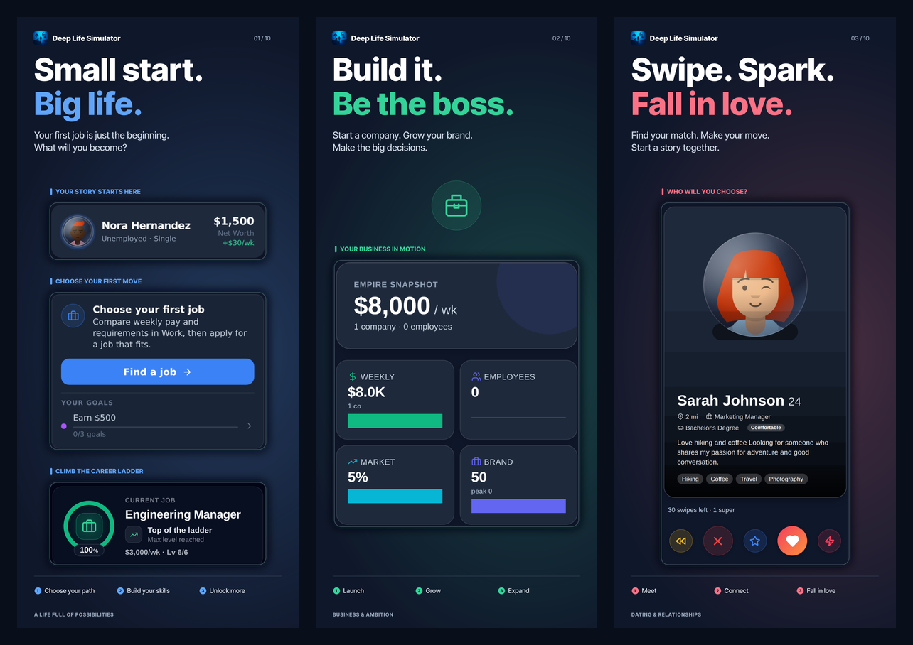

# App Store screenshots

The current set is [Small start. Big life.](player-stories-2026-09/README.md),
the player-stories campaign created 9 September 2026.

| Device | Upload folder | Dimensions |
| --- | --- | --- |
| iPhone 6.9″ | `player-stories-2026-09/iphone-6.9/` | 1320 × 2868 |
| iPhone 6.5″ | `player-stories-2026-09/iphone-6.5/` | 1284 × 2778 |
| iPad 13″ | `player-stories-2026-09/ipad-13/` | 2064 × 2752 |

Ten distinct images per device, uploaded in filename order. They cover life
choices, business, relationships, careers, education, investing, property,
cars, streaming, travel and family through player outcomes and authentic UI.



[Full iPhone overview](player-stories-2026-09/overview-iphone.png) ·
[Full iPad overview](player-stories-2026-09/overview-ipad.png)

Before uploading, verify that these existing web captures match the iOS build
being submitted. The first image uses the newer compact Home UI. Export
validation does not establish native-build parity.

## Rebuild

```bash
npm ci --prefix screenshots/appstore-2026/source
node scripts/generate-appstore-2026-set.mjs
node scripts/generate-appstore-2026-ipad.mjs
node screenshots/player-stories-2026-09/source/verify.mjs
node screenshots/player-stories-2026-09/source/previews.mjs
```

The [previous immersive campaign](appstore-2026/README.md) is retained for
comparison. Its captures, fonts and nine artwork plates are shared inputs to the
new campaign. Keep its source directories and text sidecars. Re-capture changed
screens through `scripts/capture-rich-state.mjs`, reviewing its label-driven
actions after UI changes.

Nothing here is bundled into the playable app.
