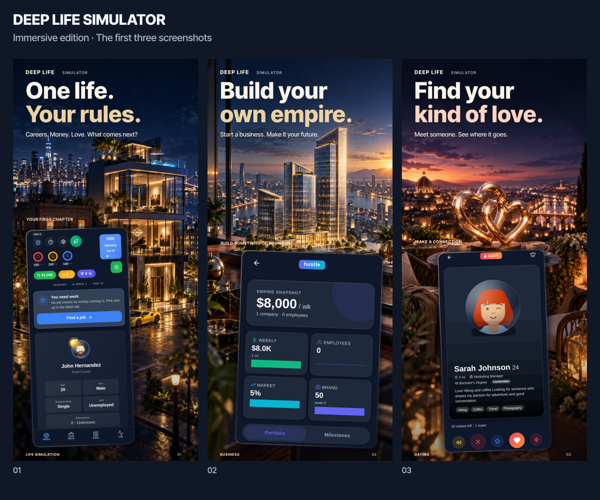

# Deep Life Simulator — Immersive App Store edition

Rebuilt 8 September 2026 following feedback on the flat blue edition.

The new direction combines cinematic 3D-style artwork, atmospheric environments, warm metallic lighting, ivory typography and gently angled gameplay panels. Each theme has its own scene. The interface is composited from actual repository captures, with no generated interface text or invented game statistics.

## Package contents

| Folder | Dimensions | Main images | Alternatives |
| --- | --- | --- | --- |
| `iphone-6.9`, `alternatives/iphone-6.9` | 1320 × 2868 | 10 | 6 |
| `iphone-6.5`, `alternatives/iphone-6.5` | 1284 × 2778 | 10 | 6 |
| `ipad-13`, `alternatives/ipad-13` | 2064 × 2752 | 10 | 5 |

47 RGB PNG exports. Choose up to ten screenshots for each device set. Alternatives replace a main image rather than extending an App Store set beyond ten. The iPad prestige alternative is omitted because its source capture does not expose that section.

## Recommended sequence

| Image | Feature | 3D artwork |
| --- | --- | --- |
| 01 | Begin a life | Modest apartment and illuminated penthouse |
| 02 | Start and grow a company | Architectural headquarters model |
| 03 | Dating | Interlocking rose-gold hearts on a terrace |
| 04 | Decisions and consequences | A branching staircase and two doors |
| 05 | Careers and education | Graduation cap, diploma and briefcase |
| 06 | Stock investing | Emerald glass columns and coins |
| 07 | Dark web and risk | Rainy city, laptop and security hardware |
| 08 | Property ownership | Residential architectural models and a key |
| 09 | Car ownership | The game's yellow supercar interpreted in a new scene |
| 10 | Family and relationships | A warm architectural cutaway of a family home |
| 11 | Health | Athletic equipment in a morning park |
| 12 | Travel | Glass globe and airplane |
| 13 | Creator life | Microphone, camera and headphones |
| 14 | Crypto | Machined digital-currency coins |
| 15 | Luxury collections | A watch and diamond on marble |
| 16 | Prestige | Crystal hourglass above a city |

The series covers the main life, relationship, work and wealth systems, with alternatives for other prominent activities. It does not attempt to document every submenu.

## Source and release check

Gameplay comes from `screenshots/appstore-2026/rich-captures` and `rich-captures-ipad` in Wrexist/DeepLifeSimulator, repository snapshot `1824b9c4148340d8a66d253ed90ceb58dc883f1b`. The source PNGs and their accompanying text are reused unchanged from `rich-captures` and `rich-captures-ipad`.

These are existing web captures at phone and tablet form factors, not newly captured native iOS screens. Before upload, confirm that the depicted UI and features match the iOS build being submitted. This change updates store artwork and tooling only. It does not publish to App Store Connect or modify the playable app.

The scenery is promotional illustration outside the gameplay panels. It does not depict a playable 3D environment. The 16 art plates were created with built-in image generation and are raster PNG assets, not editable meshes or Blender scenes. Exact prompts and reference provenance are included in `source/art-prompts.json`. Original game artwork informed the city and yellow-car scenes.

## Edit and rebuild

`source/build.mjs` owns typography, native capture crops, framing, shadows, sizing and export. `source/storyboard.json` owns headlines and feature metadata. `source/art/01.png` through `16.png` contain the distinct artwork plates. Fonts and their SIL Open Font License are included.

Requirements: Node.js, Sharp, and an SVG rendering stack with Fontconfig/Pango support. Install the isolated screenshot dependency with `npm install --prefix screenshots/appstore-2026/source` from the repository root. This does not add a dependency to the game. The renderer can also use the supplied runtime module location through `CODEX_PRIMARY_RUNTIME_NODE_MODULES`.

```bash
node screenshots/appstore-2026/source/build.mjs
node screenshots/appstore-2026/source/previews.mjs
```

For a selective revision, use `node screenshots/appstore-2026/source/build.mjs --ids=01,03,09`. For the initial three-image phone preview, use `--draft`.

## Research basis

The visual revision retains the earlier review of the [live product page](https://apps.apple.com/us/app/deep-life-simulator-tycoon/id6749675615), repository screenshots and game systems. It changes the art direction in response to feedback.

Apple recommends introducing core features early and allows up to ten screenshots per set. The initial images should work independently in search results. [Apple product page guidance](https://developer.apple.com/app-store/product-page/)

Export dimensions follow the accepted sizes in [Apple's screenshot specifications](https://developer.apple.com/help/app-store-connect/reference/app-information/screenshot-specifications/). Screenshots must accurately represent the app in use. [App Review Guidelines, accurate metadata](https://developer.apple.com/app-store/review/guidelines/#accurate-metadata)

The new visual direction is a design proposal, with no measured conversion result yet. [Product Page Optimization](https://developer.apple.com/app-store/product-page-optimization/) provides a way to compare it against the current set.

The existing `scripts/generate-appstore-2026-set.mjs` and `scripts/generate-appstore-2026-ipad.mjs` entry points also rebuild this edition. The earlier `scripts/lib/storeFrameSystem.mjs` is retained for historical tooling and is not the current campaign compositor. The new capture assertions are in `source/storyboard.json`.



[Main overview](DeepLife-Immersive-Overview.png) · [Alternative themes](DeepLife-Immersive-Alternatives.png) · [iPad overview](DeepLife-Immersive-iPad.png)
